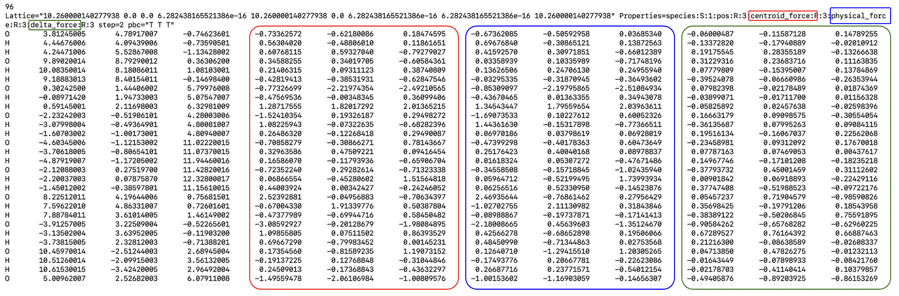

### Curating the dataset

Checkout the ```get_pigs_dataset.py``` file. This is a simple `ASE` based I/O parser which creates a set of atoms objects with positions set to centroid positions and the centroid and physical forces saved as ```centroid_force``` and ```physical_force``` arrays, respectively. Since we want to regress on the difference between the centroid and the physical forces, we store this quantity as a ```delta_force``` array. We save the dataset in an extended xyz format, which looks like the following. 


