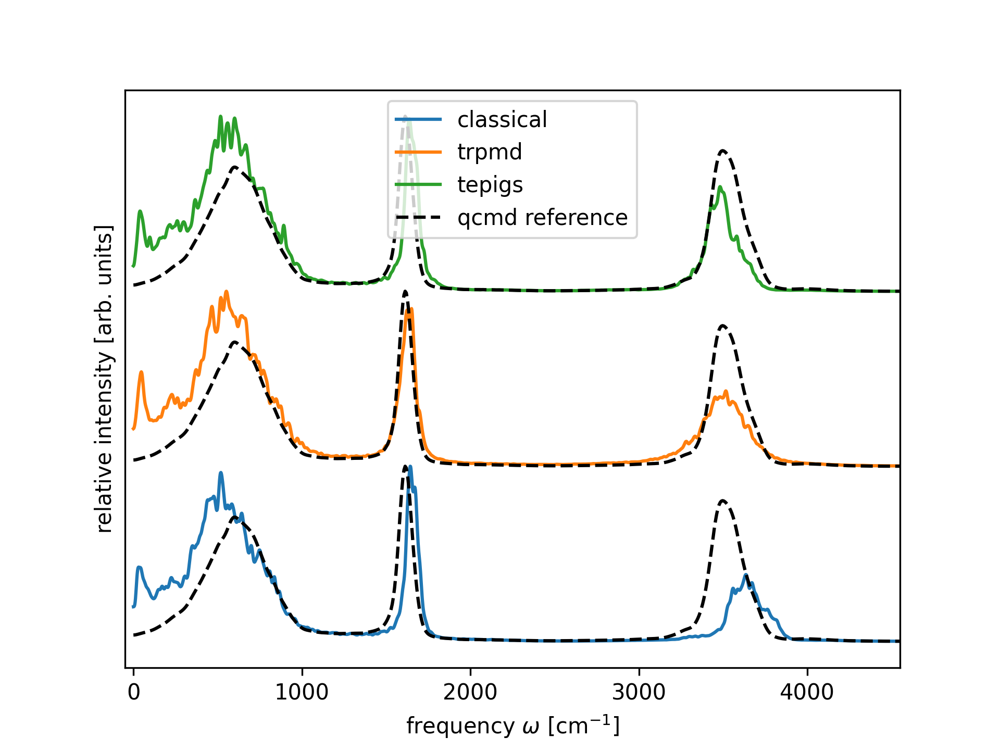

### Calculating the vibrational density of states 

You can calculate the spectra using the scripts

```bash
bash get_spectra.sh
```

and visualize them using

```bash
python plot_spectra.py 
```

The reference quantum dynamics result is taken from the quasi-centroid molecular dynamics (qcmd), which has been carefully validated but is much more expensive than thermostatted ring polymer molecular dynamics (trpmd). As you can see, the classical result is blue-shifted, and the trpmd result is broadened. The Te PIGS method has the cost of classical molecular dynamics and improved upon the accuracy of trpmd.  


