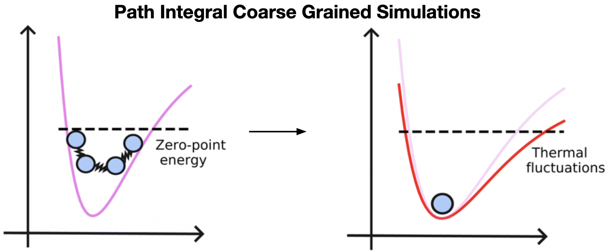

# Quantum vibrational spectroscopy using Te PIGS

Here is a demonstration of the temperature elevation (Te) path-integral coarse-graining simulation (PIGS) methods [1] for estimating the vibrational spectrum of liquid water at 300 K. We do so by machine learning an effective potential that incorporates quantum nuclear effects and performing molecular dynamics. Follow this procedure to simulate the approximate quantum dynamics of any system (for spectroscopy and transport). 

Our approach comprises two steps: 

### 1. Training

We will train a quantum effective potential corresponding to the potential of mean force of the centroid of the path integral using the Te PIGS method. The training data will be generated from a path-integral molecular dynamics simulation at an elevated temperature (Te) of 500 K. The effective potential will represented using the MACE [2] machine learning framework and fit with the path-integral coarse-graining simulation (PIGS) methods. 

### 2. Prediction (Trajectory generation)

This is as easy as performing molecular dynamics using the Te PIGS quantum effective potential at 300 K. The vibrational density of states can be estimated as the time correlation function of positions. 

## Tutorial summary 

We will predict the vibrational spectrum of water at room temperature, a widely benchmarked system. Using the MACE-OFF (S) potential [3], water can be modelled at 'density functional theory quality'. To speed things up, however, we will perform simulations with the flexible q-TIP4P/f water model [4] but provide scripts for simulations with MACE-OFF(S). 

We will predict and compare the classical and quantal vibrational density of states (without IR/Raman selection rules). The classical spectra will be generated using standard molecular dynamics. The quantal spectra will be computed using the standard ring polymer molecular dynamics and the Te PIGS approach. If time permits, we can also predict R and Raman spectra using a [machine-learning model](https://github.com/venkatkapil24/ML-quantum-vibrational-spectroscopy) to predict the polarization and polarizability of bulk water [5].  

##

Go through the individual directories and follow the instructions in the README.md files. 

| Directories                                    |
|------------------------------------------------|
| [0_reference_pimd/](./0_reference_pimd/)       |
| [1_dataset_curation/](./1_dataset_curation/)   |
| [2_training/](./2_training/)                   |
| [3_production_simulations_tepigs/](./3_production_simulations_tepigs/) |
| [4_production_simulations_classical/](./4_production_simulations_classical/) |
| [5_production_simulations_trpmd/](./5_production_simulations_trpmd/) |
| [6_vibrational_dos_spectra/](./6_vibrational_dos_spectra/) |
| [7_optional_dielectric_reponse_calculations/](./7_optional_dielectric_reponse_calculations/) |
| [8_optional_ir_and_raman_spectra/](./8_optional_ir_and_raman_spectra/) |

## Python Setup

We need to set up a python (or conda) environment for [mace](https://github.com/ACEsuit/mace) and [i-PI](https://github.com/i-pi/i-pi). 

## References 

1. Musil, F., Zaporozhets, I., Noé, F., Clementi, C., & Kapil, V. (2022). Quantum dynamics using path integral coarse-graining. *The Journal of Chemical Physics, 157*(18), 181102. [https://doi.org/10.1063/5.0120386](https://doi.org/10.1063/5.0120386)

2. Batatia, I., Kovacs, D. P., Simm, G. N. C., Ortner, C., & Csanyi, G. (2022). MACE: Higher Order Equivariant Message Passing Neural Networks for Fast and Accurate Force Fields. *Advances in Neural Information Processing Systems*. [https://openreview.net/forum?id=YPpSngE-ZU](https://openreview.net/forum?id=YPpSngE-ZU)

3. Kovács, D. P., Moore, J. H., Browning, N. J., Batatia, I., Horton, J. T., Kapil, V., Witt, W. C., Magdău, I.-B., Cole, D. J., & Csányi, G. (2023). Mace-off23: Transferable machine learning force fields for organic molecules. [https://doi.org/10.48550/ARXIV.2312.15211](https://doi.org/10.48550/ARXIV.2312.15211)

4. Habershon, S., Markland, T. E., & Manolopoulos, D. E. (2009). Competing quantum effects in the dynamics of a flexible water model. The Journal of Chemical Physics, 131(2). [https://doi.org/10.1063/1.3167790](https://doi.org/10.1063/1.3167790)

5. Kapil, V., Kovács, D. P., Csányi, G., & Michaelides, A. (2023). First-principles spectroscopy of aqueous interfaces using machine-learned electronic and quantum nuclear effects. *Faraday Discussions*. [https://doi.org/10.1039/D3FD00113J](https://doi.org/10.1039/D3FD00113J)

## Contact

Feel free to email Venkat Kapil [v.kapil@ucl.ac.uk](v.kapil@ucl.ac.uk) for any questions. 
